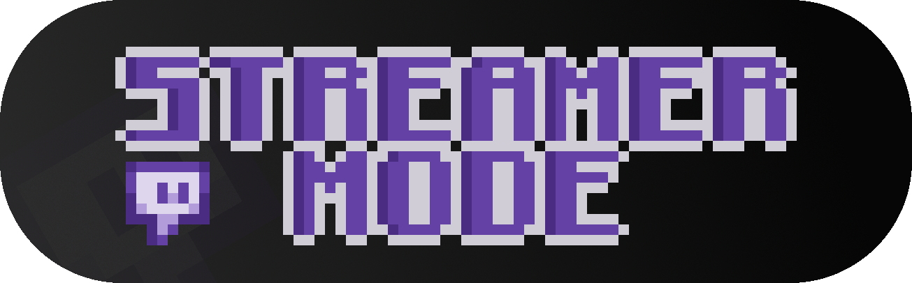

# StreamerMode

A 1.21.1 Fabric mod for official DiamondFire streaming and content creation.

## Dependencies
1. [YetAnotherConfigLib](https://modrinth.com/mod/yacl)
2. [Twitch4J](https://modrinth.com/mod/twitch4j)

## Streamer Features

Features only available to streamers.

### Twitch Plot Queue

Run /queue for a list of currently queued plots, click on a plot to join it and remove it from the queue. A message is later sent to un-hide the plot. Entries whose description contain "node beta" will have an extra message below signifying the plot may be on node beta.

### Chat Message Hiding

Hide messages from the chat matching a custom regex or messages that are:

-   Admin messages
-   Moderation messages
-   Support messages
-   Direct messages
-   Plot advertisements
-   Plot boosts
-   Spy messages (session, dm, and muted spy)
-   Plugin update messages (BuycraftX, FastAsyncWorldEdit, and ViaVersion)

Messages in the list that also play a sound also have their sound muted.

## Non Streamer Features

Features available to anyone using the mod.

### Twitch Chat Relay

When joining DiamondFire the twitch channel in the config will be relayed into the game with unique indicators for subscribers, moderators, and bits, the system automatically updates to config changes.

### Network Protocol Error Suppression

An enabled by default config option that suppresses server kicks causes by network protocol errors.

### Config

Configure the mod using ModMenu or `/streamermode`.

## Note

When running the mod in a development environment, such as through Intellij, streamer features will be enabled regardless on whether the account is permitted to use them.

## Account Authentication

Being logged in is important when testing, this is why the project has **DevAuth** included.

Depending on your operating system, create a `config.toml` file in one of the following directories:

-   `C:\Users\<user>\.devauth`
-   `/Users/<user>/.devauth`
-   `~/.config/devauth`

And inside paste the following:

```toml
defaultEnabled = true

defaultAccount = "main"

[accounts.main]
type = "microsoft"
```

When launching the game through the Minecraft Client configuration in IntelliJ you will be prompted to authenticate your Microsoft account, this will only happen once, after that you will be logged into your account snd in any future runs.
